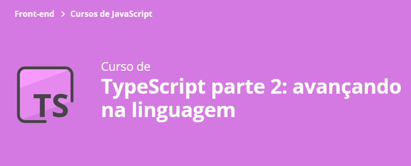

### Aula 1:
- Inspiração no React para criação de templates declarativos e dinâmicos; :white_check_mark:
- Manipulação declarativa do DOM através de template; :white_check_mark:
- Template dinâmico; :white_check_mark:
- Formatação de datas usando Intl. :white_check_mark:

### Aula 2:
- Herança com TypeScript; :white_check_mark:
- Classes com tipo genérico; :white_check_mark:
- Classes abstratas; :white_check_mark:
- O modificador protected. :white_check_mark:

### Aula 3:
- Visibilidade de métodos; :white_check_mark:
- Validando negociações em dias úteis; :white_check_mark:
- Vantagens do uso de enums; :white_check_mark:
- Cuidados com enums. :white_check_mark:

### Aula 4:
- Revisão da lógica de conversão negociações; :white_check_mark:
- Método estáticos; :white_check_mark:
- Parâmetros opcionais. :white_check_mark:

### Aula 5 final:
- Remoção de comentários do código compilado; :white_check_mark:
- Ativação do strictNullChecks; :white_check_mark:
- Como suprimir erros, quando fizer sentido, resultantes do strictNullChecks; :white_check_mark:
- Benefícios do strictNullChecks no controle do fluxo da sua aplicação. :white_check_mark:

## 🔨 A saber sobre o curso
- Aprenda a utilizar modificadores de acesso, herança e tipos genéricos
- Entenda o papel das Enumerations
- Crie um mini framework de atualização de view inspirado no JSX
- Configure ainda mais seu compilador TS e tire máximo proveito do seu código

## ✔️ Técnicas e tecnologias utilizadas
- `HTML & CSS`
- `TypeScript`
- `JavaScript`
- `Bootstrap`

## 🛠️ Abrir e rodar o projeto
Para abrir e rodar o projeto, execute `npm i` para instalar as dependências e `npm run start` para iniciar o projeto.

## 📚 Mais informações do curso
Busque na plataforma da Alura o curso **TypeScript parte 2: avançando na linguagem** publicado na Escola Frontend.

 
